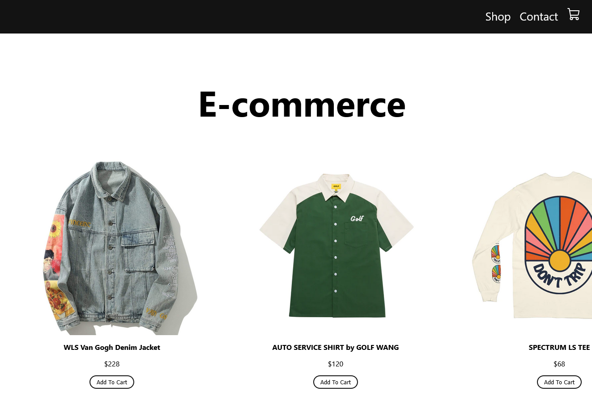
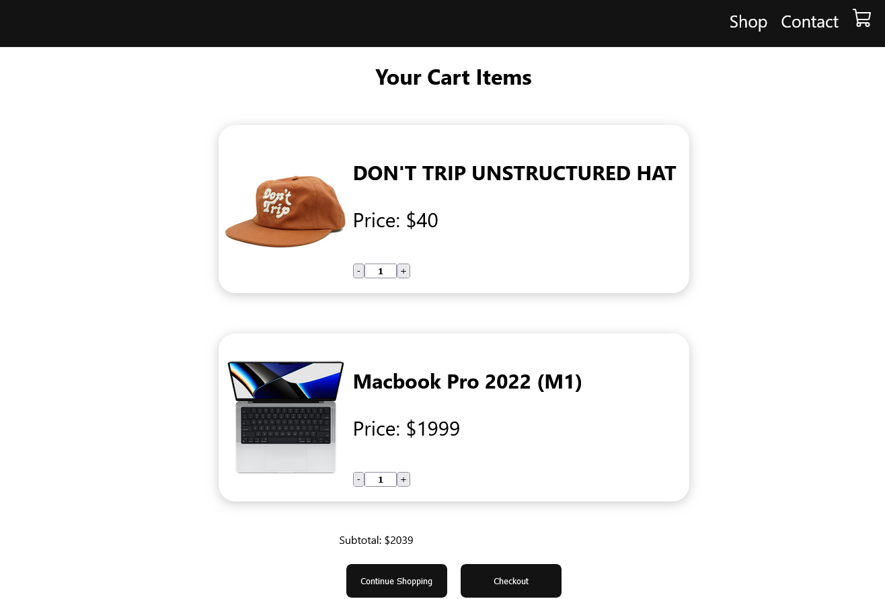

Project Overview:

This project involves the development of a streamlined e-commerce website, primarily focusing on the user's ability to add products to a shopping cart and view their shopping list. It aims to offer a simple yet efficient online shopping experience.

Key Features:

Add to Cart: Users can easily add products to their cart from product listings.
Shopping List: View all selected items in a concise and organized shopping list.

Screenshots:

